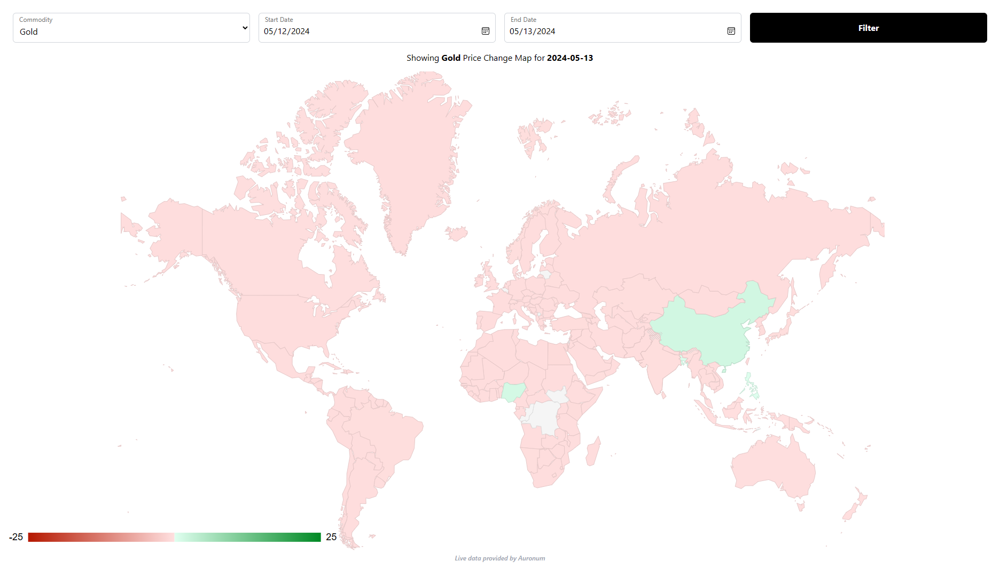
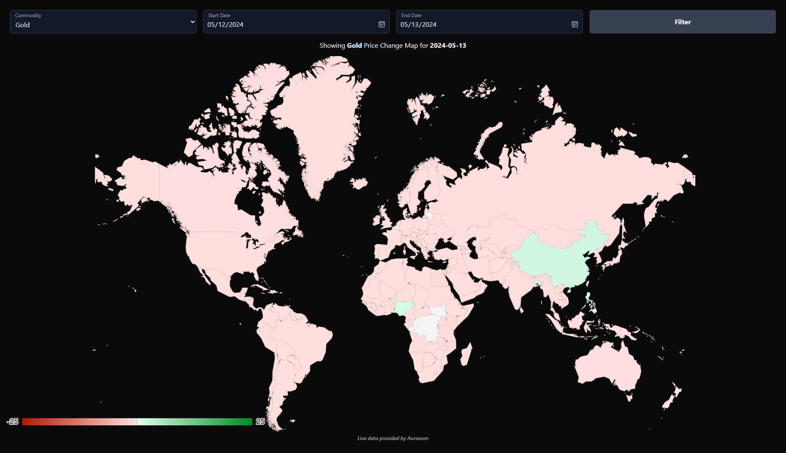

# Gold Currency Heat Map

## Description

Gold Currency Heat Map is a WordPress plugin that allows you to embed a customizable heat map on your website. This heat map visually represents the performance of Gold, Silver, Platinum, and Palladium against different countries' currencies. Each country on the map changes color according to whether the metals have risen or fallen against its currency.

## Features

- Easily embed the Gold Currency Heat Map into your posts, pages, or widgets using a simple shortcode.
- Customize the appearance of the heat map by specifying a theme (dark or light).
- Provides a user-friendly interface for visitors to visualize precious metals' performance against various currencies.

## Installation

1. Upload the `gold-currency-heat-map` folder to the `/wp-content/plugins/` directory. Or upload the `gold-currency-heat-map.zip` file in the 'Plugins' menu from WordPress.
2. Activate the plugin through the 'Plugins' menu in WordPress.
3. Use the shortcode `[gold_currency_heat_map]` in your posts, pages, or widgets to embed the heat map.

## Frequently Asked Questions

### How do I customize the appearance of the heat map?

You can customize the heat map's appearance by specifying a theme in the shortcode. Themes available are "dark" and "light". For example: `[gold_currency_heat_map theme="dark"]`.

## Screenshots

1. 
2. 

## Changelog

### 1.0
- Initial release.

## Upgrade Notice

### 1.0
- Initial release.

## Credits

Gold Currency Heat Map is developed by [auronum](https://auronum.co.uk).

## Contact

For technical support or inquiries, please contact us at [support@auronum.co.uk](mailto:support@auronum.co.uk).

## Visit Us

Visit our website at [auronum.co.uk](https://auronum.co.uk) for more information.

## Download

You can download the latest release of Gold Currency Heat Map from [GitHub](https://github.com/yourusername/gold-currency-heat-map/releases/latest).

## Thank You

Thank you for using Gold Currency Heat Map!